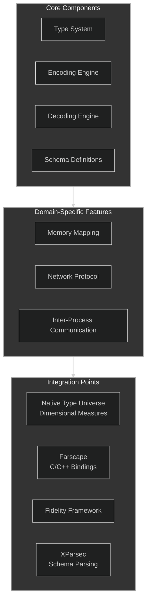
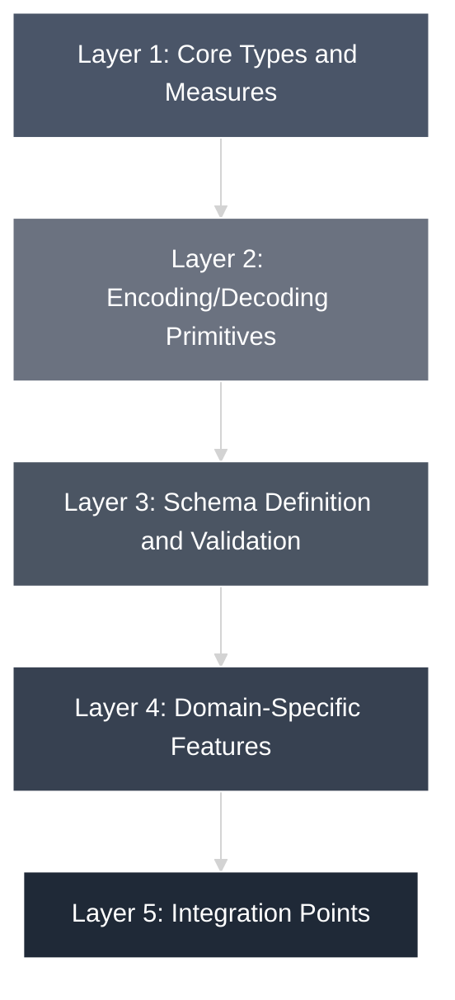
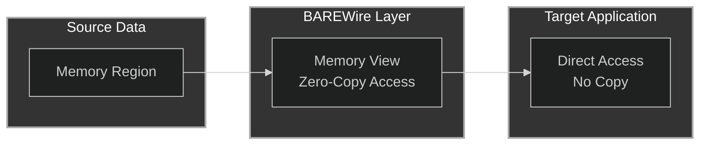

# BAREWire Architecture Overview

BAREWire is designed as a modular system with several core components that work
together to provide a comprehensive solution for binary data encoding, memory
mapping, and communication.

> **Read [Substrate_Formalism](./Substrate_Formalism.md) first.** It states what
> BAREWire is: a formalizable substrate upholding a *typed contract* across a
> boundary, not a memory layout and not a wire format. The encoding serves the
> contract, not the other way round. [10 The Case from
> Practice](./10%20The%20Case%20from%20Practice.md) supplies the evidence from
> two projects that crossed boundaries without it.

## Project Structure

One source tree, three project files: `src/BAREWire.fidproj` (Clef, Composer), `src/BAREWire.fsproj` (.NET, referenced by Composer so the platform observers run inside the compiler), `src/BAREWire.Fable.fsproj` (JavaScript). Only the `Encoding/Substrate/` shim files differ between them. [Implementation Status](./Implementation%20Status.md) is the ledger of what each tier does and which gates it passes.

```text
BAREWire/
├── src/
│   ├── Encoding/                 # 02: the BARE codec over bounded byte extents
│   │   ├── Cursor.fs             #     the fault offset and bounds checks
│   │   ├── Substrate/            #     one Text and one Float shim per compiler
│   │   ├── Fmt.fs                #     portable number formatting for text residuals
│   │   ├── Encoder.fs
│   │   ├── Decoder.fs
│   │   └── Codec.fs              #     whole-value combinators
│   ├── Framing/
│   │   └── Envelope.fs           # 05: kind, correlation, payload; length prefix on streams; Hello
│   ├── Schema/                   # 03: BARE's fixed vocabulary
│   │   ├── Definition.fs
│   │   ├── Validation.fs
│   │   ├── Analysis.fs           #     wire size, packed offsets, compatibility
│   │   ├── Emit.fs               #     .bare schema text (the schema-shared artifact)
│   │   └── DSL.fs
│   ├── Hardware/                 # 08, 10: descriptors in fixed widths
│   │   ├── Descriptors.fs
│   │   ├── Abi.fs                #     ABI profiles (SysV AMD64, AAPCS, ...)
│   │   └── Validator.fs          #     descriptor + ABI -> agreement verdict
│   ├── Memory/                   # 04: Region and View
│   │   ├── Region.fs
│   │   └── View.fs
│   └── Platform/                 # 11: the description and its observers
│       ├── Tags.fs               #     string-alias vocabularies
│       ├── Description.fs        #     MemorySpace, BufferSchema, BoundarySurface, Transport, ...
│       ├── Check.fs              #     declaration consistency
│       ├── Manifest.fs           #     the memory-map manifest (the CPU's XDC)
│       └── Obligations.fs        #     proof obligations stated against declarations
├── samples/RoundTrip/            # the native gate: a reachable program compiled by Composer
└── tests/                        # the .NET gate (golden vectors) and the JavaScript differential
```

What the documents specify beyond this tree, design only: the transport, RPC, and streaming layers of [05](./05%20Network%20Protocol.md); the shared-memory, queue, and pipe layers of [06](./06%20IPC%20Integration.md) over Fidelity.Platform's bindings ([07](./07%20IPC%20Platform%20Specific%20APIs.md)); the cache-aware layout analysis of [09](./09%20Cache-Aware%20Layouts.md); the `.bare` schema *parser* and codec generation for foreign languages ([03](./03%20Schema%20System.md), Readiness Audit step 14).

## Core Components



## Design Principles

1. **Zero Dependencies**: BAREWire is implemented with no external dependencies, making it suitable for constrained environments.

2. **Type Safety**: compile-time safety through the native type universe's dimensional measures — offset, byte, count, and region distinctions carried in the types themselves (see [01 Core Types and Measures](./01%20Core%20Types%20and%20Measures.md)).

3. **Performance First**: All operations are optimized for high performance with minimal allocations and efficient memory usage.

4. **Composability**: Components are designed to be composable, allowing developers to use only the parts they need.

5. **Boundary Reach**: the substrate discipline extends wherever a TCB can be articulated — native targets through the Fidelity Framework, and the type-erasure boundary of the JavaScript/WREN path ([Substrate_Formalism](./Substrate_Formalism.md), §"two boundaries").

## Layered Architecture

BAREWire follows a layered architecture:



### Layer 1: Core Types and Measures

The foundation of BAREWire consists of core types and units of measure that define the binary format and ensure type safety.

### Layer 2: Encoding/Decoding Primitives

This layer provides the fundamental operations for encoding and decoding primitive BARE types.

### Layer 3: Schema Definition and Validation

Schemas define the structure of BARE messages and provide validation during encoding and decoding.

### Layer 4: Domain-Specific Features

This layer implements domain-specific features like memory mapping, network protocols, and IPC.

### Layer 5: Integration Points

The topmost layer provides integration points with other systems like Farscape, the Fidelity Framework, and application code.

## Memory Management

BAREWire uses a zero-copy approach whenever possible to minimize allocations and copies:



This architecture enables efficient processing of large binary data structures without unnecessary memory copying.