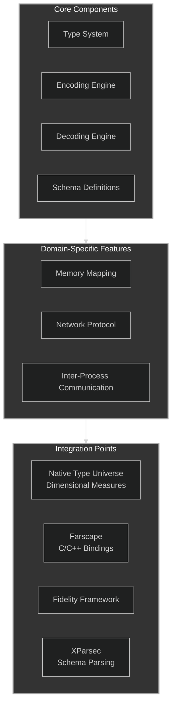
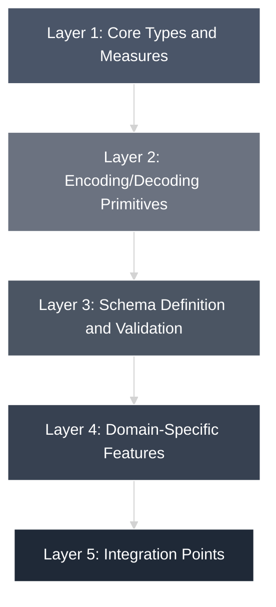
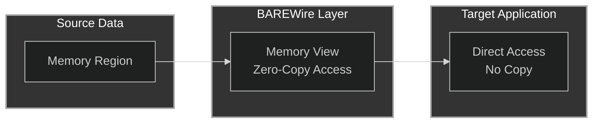

# BAREWire Architecture Overview

BAREWire is designed as a modular system with several core components that work
together to provide a comprehensive solution for binary data encoding, memory
mapping, and communication.

> **Read [Substrate_Formalism](./Substrate_Formalism.md) first.** It states what
> BAREWire is: a formalizable substrate upholding a *typed contract* across a
> boundary, not a memory layout and not a wire format. The encoding serves the
> contract, not the other way round. [10 The Case from
> Practice](./10%20The%20Case%20from%20Practice.md) supplies the evidence from
> two projects that crossed boundaries without it.

## Project Structure

Two trees are listed below, because they differ and the difference is the point.
Documents in this folder specify a system considerably larger than what is
built; treating them as a description of the repository has caused confusion
before. See [Implementation Status](./Implementation%20Status.md) for the ledger.

**What exists** (`src/`, and what `BAREWire.fidproj` compiles):

```text
BAREWire/src/
├── Hardware/
│   └── Descriptors.fs     # Peripheral, field, bitfield and StructDescriptor types
├── Encoding/
│   ├── Memory.fs          # Memory representation and operations
│   ├── Encoder.fs         # Encoding primitives
│   ├── Decoder.fs         # Decoding primitives
│   └── Codec.fs           # Combined encoding/decoding operations
└── Schema/
    ├── Definition.fs      # Schema type definitions
    ├── Validation.fs      # Schema validation logic
    ├── Analysis.fs        # Schema analysis tools
    └── DSL.fs             # Domain-specific language for schema definition
```

**What the documents specify** — design only, no implementation:

```text
├── Memory/                # 04 Memory Mapping — Region, View, address calculation
├── Network/               # 05 Network Protocol — Frame, Transport, Protocol
├── IPC/                   # 06/07 IPC — shared memory, queues, pipes
└── (tier modules)         # BAREWire.HSA / .CXL / .RDMA — the three scales
```

A `Core/` module is referenced by the orphaned test project and by older
documents. It does not exist; error and core types moved out during the
compiler-services migration.

## Core Components



## Design Principles

1. **Zero Dependencies**: BAREWire is implemented with no external dependencies, making it suitable for constrained environments.

2. **Type Safety**: compile-time safety through the native type universe's dimensional measures — offset, byte, count, and region distinctions carried in the types themselves (see [01 Core Types and Measures](./01%20Core%20Types%20and%20Measures.md)).

3. **Performance First**: All operations are optimized for high performance with minimal allocations and efficient memory usage.

4. **Composability**: Components are designed to be composable, allowing developers to use only the parts they need.

5. **Boundary Reach**: the substrate discipline extends wherever a TCB can be articulated — native targets through the Fidelity Framework, and the type-erasure boundary of the JavaScript/WREN path ([Substrate_Formalism](./Substrate_Formalism.md), §"two boundaries").

## Layered Architecture

BAREWire follows a layered architecture:



### Layer 1: Core Types and Measures

The foundation of BAREWire consists of core types and units of measure that define the binary format and ensure type safety.

### Layer 2: Encoding/Decoding Primitives

This layer provides the fundamental operations for encoding and decoding primitive BARE types.

### Layer 3: Schema Definition and Validation

Schemas define the structure of BARE messages and provide validation during encoding and decoding.

### Layer 4: Domain-Specific Features

This layer implements domain-specific features like memory mapping, network protocols, and IPC.

### Layer 5: Integration Points

The topmost layer provides integration points with other systems like Farscape, the Fidelity Framework, and application code.

## Memory Management

BAREWire uses a zero-copy approach whenever possible to minimize allocations and copies:



This architecture enables efficient processing of large binary data structures without unnecessary memory copying.